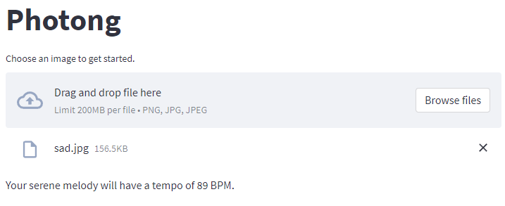

## Using Photong
When you first open the page, you may see a few spinners and loading texts. Please wait patiently until they disappear.

After the initialisation completes, you should be able to see a file uploader.

Click on the uploader. You will be prompted to select an image. Note that only images with extensions `.png`, `.jpg` and `.jpeg` images are supported.

After the image is uploaded successfully, the app will start running a sequence of steps. The first output you will notice is a line of text that states the "tempo" (speed) of the melody being generated.

The generation process may take a while, during which some models may need to be downloaded and loaded in the app.

If the process succeeds, you will see a new section called "Result". Below the section heading, you will see the original image that you uploaded, as well as a green success box that says "Here is your melody!". Below the success box, you should be able to see a media player that can play the melody back for you. Click on the play triangle button to listen to the generated melody.

To preserve the generated melody, you can click on the three dots on the right of the audio player and select "Download". The audio file will automatically be saved to your computer.

Alternatively, you can click on the "Download MIDI" button below the audio player and save the MIDI file to your computer. A MIDI file can be opened by any musical notation or production software, such as [MuseScore](https://musescore.org/) or any DAW (Digital Audio Workstation) software.

If you run into a problem, please [open an issue](https://github.com/leranjun/photong-web-app/issues/new).
